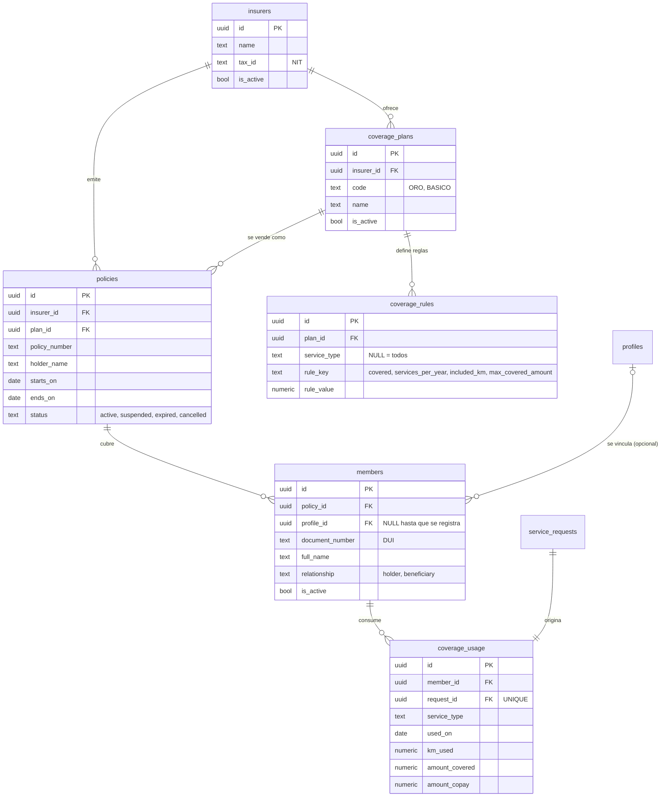

# Modelo de pólizas y cobertura — ERD

> Entregable **B-08** (Fase 1). Migración `supabase/migrations/00044_insurance_coverage_model.sql`.
> Datos semilla en `supabase/seed.sql`.
>
> Creado: 2026-08-26

Es la capa que convierte "app de grúas" en "asistencia de seguro": a partir de
aquí un servicio puede nacer de una **cobertura válida** en vez de un pago suelto.

---

## Diagrama



---

## Las tres decisiones que explican el diseño

### 1. Las reglas son filas, no columnas

`coverage_rules` guarda **una fila por regla** en lugar de darle a
`coverage_plans` columnas fijas como `max_servicios_anio` o `km_incluidos`.

El motivo es concreto: **B-02 sigue pendiente**. Todavía no hay una aseguradora
que haya validado qué vende realmente una póliza de asistencia en El Salvador, y
el propio backlog advierte "no construir el modelo de cobertura equivocado". Con
columnas rígidas, cada hallazgo del discovery costaría una migración, un cambio
de tipos y un despliegue. Con reglas como datos, ajustar la cobertura es cambiar
filas de configuración.

`service_type` en `NULL` significa "aplica a todos los tipos"; una fila con el
tipo concreto lo sobrescribe. Así se expresa una cobertura completa sin enumerar
los seis servicios:

| `service_type` | `rule_key` | `rule_value` | Se lee como |
|---|---|---|---|
| `NULL` | `covered` | 1 | Todo cubierto por defecto |
| `tow` | `services_per_year` | 4 | …pero grúa, máximo 4 al año |
| `tow` | `included_km` | 25 | …con 25 km incluidos (el resto va a copago) |
| `tow` | `max_covered_amount` | 150 | …y hasta $150 por evento |
| `locksmith` | `covered` | 0 | Cerrajería excluida |

El Plan Básico del seed hace lo inverso: `covered = 0` general y luego habilita
solo `tow` y `battery`.

> El **motor que evalúa** estas reglas es **B-12**, no este ítem. Aquí solo se
> define dónde viven. Las cuatro `rule_key` están bajo un `CHECK`, así que añadir
> una regla nueva sí requiere migración — es el punto medio deliberado entre un
> `JSONB` sin forma y unas columnas rígidas.

### 2. El afiliado existe antes que la cuenta

`members.profile_id` es **nullable**. La aseguradora carga su padrón (B-10)
mucho antes de que sus afiliados descarguen Budi; la mayoría de las filas de
`members` no tendrán cuenta durante un buen tiempo. El match posterior se hace
por `document_number`, que es único dentro de cada póliza.

Consecuencia práctica: nunca asumir que `members.profile_id` está presente.

### 3. RLS cerrado desde el primer día

`members` guarda PII de personas que **ni siquiera son usuarias de la app**
(nombre, DUI, teléfono). Es exactamente lo que motivó adelantar B-07 desde la
Fase 4. Por eso el acceso nace restringido:

| Rol | Acceso |
|---|---|
| **ADMIN** | Todo (`FOR ALL`) |
| **Afiliado** (`members.profile_id = auth.uid()`) | Solo lectura de lo suyo: su ficha, su póliza, su plan, las reglas de su plan, su aseguradora y su consumo |
| **Operador** | Ninguno |
| **anon** | Revocado explícitamente |

Verificado con RLS real antes de aplicar: admin ve todo; el afiliado ve su
cobertura completa; un usuario registrado pero **no** afiliado ve 0 en las seis
tablas; el operador ve 0.

El portal de la aseguradora (**B-17**) traerá su propio rol y sus políticas —
hoy ninguna aseguradora tiene acceso directo.

---

## Integridad

Tres restricciones que el modelo hace cumplir, todas verificadas:

- **Una regla por combinación.** `UNIQUE (plan_id, COALESCE(service_type,'*'), rule_key)`.
  Un `UNIQUE` normal no serviría: en SQL dos `NULL` no son iguales entre sí, así
  que dejaría duplicar las reglas generales. De ahí el índice con `COALESCE`.
- **Un servicio consume una sola vez.** `coverage_usage.request_id` es `UNIQUE`,
  así que un mismo servicio no puede descontar dos veces del plan.
- **Vigencias coherentes.** `CHECK (ends_on IS NULL OR ends_on >= starts_on)` en
  `policies` y en `members`.

---

## Qué se apoya en esto

| Ítem | Qué añade |
|---|---|
| **B-09** | Admin CRUD: aseguradora → póliza → plan → afiliado |
| **B-10** | Importación masiva de afiliados por CSV + API |
| **B-11** | Verificar afiliado activo al solicitar |
| **B-12** | Motor que evalúa `coverage_rules` y escribe `coverage_usage` |
| **B-13** | Cálculo del copago cuando el servicio excede la cobertura |

La consulta base de B-12 —traer las reglas que aplican a un afiliado— ya funciona:

```sql
SELECT r.service_type, r.rule_key, r.rule_value
  FROM coverage_rules r
  JOIN policies p ON p.plan_id = r.plan_id
  JOIN members  m ON m.policy_id = p.id
 WHERE m.profile_id = auth.uid();
```

Y el conteo de eventos del año, que decide si queda cobertura, está cubierto por
el índice `coverage_usage (member_id, used_on DESC)`.

---

## Datos semilla

`supabase/seed.sql` carga: 1 aseguradora (*Seguros Demo*), 2 planes (**ORO**,
**BASICO**) con 10 reglas, 2 pólizas y 3 afiliados. El titular de la póliza
`POL-2026-0001` queda vinculado a `usuario1@gruas.sv` si esa cuenta existe, para
poder probar la vista del afiliado; los otros dos quedan sin cuenta, que es el
caso realista de un padrón recién importado.

Relacionado: [`PLAN_ASEGURADORAS.md`](./PLAN_ASEGURADORAS.md) ·
[`backlog-aseguradoras.html`](./backlog-aseguradoras.html) ·
[`PROTECCION_DATOS.md`](./PROTECCION_DATOS.md)

---

## Verificación de cobertura al solicitar (B-11)

Implementado en `supabase/migrations/00047_coverage_check_on_request.sql`.

### Qué responde y qué no

`check_member_coverage()` responde **una** pregunta: *¿quien solicita es un
afiliado con cobertura vigente?* No evalúa las reglas del plan (eventos/año, km
incluidos, monto máximo) ni calcula copago — eso es **B-12** y **B-13**. Por eso
la fila de `coverage_usage` nace con `amount_covered = 0` y `amount_copay = 0`:
en B-11 solo registra el **vínculo servicio↔afiliado**.

### Los cuatro estados

`service_requests.coverage_status` (TEXT + CHECK; `NULL` = solicitud anterior a B-11):

| Estado | Significa | Fila en `coverage_usage` |
|---|---|---|
| `covered` | Afiliado y póliza vigentes | Sí |
| `none` | No es afiliado — paga como particular | No |
| `inactive` | Es afiliado pero algo no está vigente (con motivo) | No |
| `error` | **No se pudo verificar** | No |

### La decisión de diseño: falla abierta, nunca en silencio

Si la verificación revienta, la solicitud **se crea igual** marcada como `error`.
Es asistencia vial: bloquear a alguien varado de noche porque una consulta falló
es peor que cobrarle de más y corregirlo después.

Pero *falla abierta* no es *falla en silencio*. El fallo deja tres rastros:

1. `service_requests.coverage_status = 'error'`, con índice parcial para listarlas;
2. un evento `COVERAGE_CHECKED` en `request_events` con el `SQLSTATE + SQLERRM`;
3. el RPC devuelve `coverage` al cliente, que pinta un banner ámbar diciendo que
   el servicio continúa y puede cobrarse como particular.

En el panel, esas solicitudes salen con badge rojo **«Cobertura sin verificar»**
en la lista y con una nota de acción en el detalle.

Para invertirlo a *falla cerrada*, cambiar el bloque `EXCEPTION` de
`create_service_request` por un `RAISE`.

### Vinculación diferida por documento

La aseguradora carga su padrón (B-10) antes de que sus afiliados instalen la app,
así que `members.profile_id` suele venir NULL. En la primera verificación se
vincula por `document_number`, comparado con `normalize_document()` (solo dígitos)
porque `01234567-8` y `012345678` son el mismo DUI. Solo se toman filas con
`profile_id IS NULL`: nunca se le quita un afiliado a otra cuenta.

---

## Motor de reglas (B-12)

`supabase/migrations/00050_coverage_rules_engine.sql`.

`evaluate_coverage()` toma las reglas del plan y parte el total del servicio en
**lo que asume la aseguradora** y **el copago del afiliado**. Se ejecuta al
*completar* el servicio, que es cuando existen precio final y km reales, desde
`complete_service_request()`. `preview_my_coverage()` hace lo mismo acotado al
usuario autenticado, para mostrarlo *antes* de confirmar (B-13).

### Orden de evaluación

1. **¿Cubierto?** Regla `covered` con precedencia específica > general.
   **Sin regla `covered` no hay cobertura**: un plan que no declara nada no cubre
   nada, porque lo contrario le facturaría a la aseguradora servicios que nunca
   aceptó.
2. **¿Quedan eventos?** `services_per_year` dentro del **año de póliza** (no el
   calendario: una póliza que arranca el 31 de diciembre corre hasta el 30 del
   diciembre siguiente). Solo cuentan los servicios **completados** — B-11 crea
   la fila de `coverage_usage` al solicitar, así que contar filas a secas haría
   que una cancelación gastara un evento. El conteo tiene el **mismo alcance que
   la regla**: "Grúa: 4 al año" cuenta solo grúas.
3. **Km de arrastre.** El excedente sobre `included_km` se le cobra al afiliado
   al precio por km de la tarifa vigente, según el tipo de grúa. Ojo:
   `coverage_rules.included_km` (lo que cubre la aseguradora) no es
   `pricing_rules.included_km` (lo que ya trae la tarifa base).
4. **Tope por evento.** `max_covered_amount` limita lo que asume la aseguradora;
   el resto es copago.

### Lo que no hace

No revalida la vigencia de la póliza al cerrar. B-11 ya la verificó al solicitar
y esa autorización vale: si la póliza venció mientras la grúa estaba en camino,
el servicio sigue cubierto.

Si el reparto falla, el servicio **se cierra igual** y la solicitud queda en
`coverage_status = 'error'` con el motivo en el historial — mismo criterio que
B-11. Los montos quedan en 0, que significa "sin decidir", no "sin cobertura".
